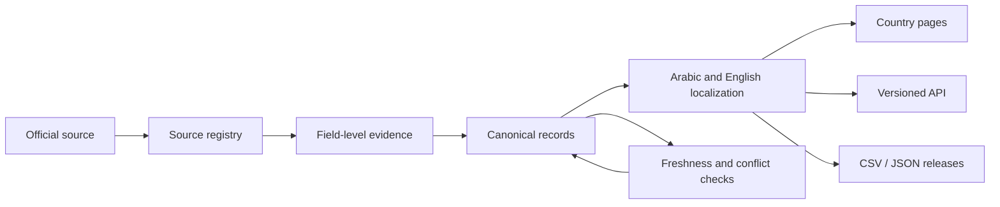

# VisaAdvisor Global Travel Intelligence Reference

**Country Hub v0.1.0 — foundation and verified seed**

Country Hub is a source-dated, bilingual-ready, versioned travel-intelligence system. It is designed to power country pages, comparisons, downloadable datasets, research, and future APIs from one canonical evidence layer.

This is not a finished worldwide database and it is not a collection of copied travel articles. Version 0.1.0 establishes the data contracts, evidence rules, freshness policy, release controls, and the first reusable records.

## What exists in v0.1.0

- 12 South American jurisdiction planning profiles, imported from the verified South America Travel Planning Index v1.1.
- 8 short-visit entry-rule records for ordinary Egyptian passport holders, imported from Egyptian Passport Entry Rules v13.0.
- 58 normalized source records: 56 registry records plus 2 official route-level URLs that the Egyptian v13 route table cited but its source registry omitted.
- Field-level evidence links that distinguish official-source synthesis from VisaAdvisor editorial judgment.
- A coverage matrix that leaves unsupported domains visibly empty.
- Reproducible seed-building and validation scripts.
- A portable semantic-layer guide for future analysis and reporting.

The source datasets remain canonical for their published releases:

- [South America Travel Planning Index v1.1](https://doi.org/10.5281/zenodo.21765168)
- [Egyptian Passport Entry Rules v13.0](https://doi.org/10.5281/zenodo.21744802)

## Architecture



One factual value is stored once, scoped to a specific traveller scenario and effective date, then reused everywhere. Pages must never become separate factual databases.

## Repository map

| Path | Purpose |
| --- | --- |
| `schema/` | Entity model and machine-readable table contracts |
| `governance/` | Source, freshness, correction, privacy, and high-stakes rules |
| `data/seed/v0.1.0/` | Generated seed release |
| `data/templates/` | Empty contracts for the next domain modules |
| `locales/` | Controlled Arabic–English terminology |
| `templates/` | Country-page publishing template |
| `api/` | Initial OpenAPI contract |
| `scripts/` | Deterministic seed build and validation |
| `releases/` | Human-readable release history |

## Build and validate

From the workspace root:

```powershell
powershell -ExecutionPolicy Bypass -File .\scripts\build-seed.ps1
powershell -ExecutionPolicy Bypass -File .\scripts\validate.ps1
```

The build reads the two existing canonical workspace datasets. It does not scrape the web, overwrite those datasets, or infer missing values.

## Interpretation rules

- Blank means **not supplied or not supported in this release**. It never means “none.”
- `last_verified` is an evidence date, not a guarantee that a rule remains current.
- Visa exemption, ETA, eVisa, visa on arrival, and consular visa are different traveller actions.
- Maximum stay and authorisation validity are different concepts; the legacy seed preserves ambiguous source wording until it is atomized in a reviewed revision.
- Suggested trip length, route intensity, gateway framing, and selected experiences are editorial planning judgments unless field evidence says otherwise.
- Entry, immigration, health, safety, tax, and financial material cannot be published definitively when its official evidence is stale, missing, or disputed.
- Personal identity documents and contact details are excluded from the public reference.

## Current coverage

| Domain | v0.1.0 status |
| --- | --- |
| Jurisdiction identity | Partial seed |
| South America planning | 11 reviewed profiles plus one provisional Venezuela profile due for review |
| Egyptian-passport entry rules | 8 verified-as-of records; next review due 2026-08-25 |
| Cities | Contract only |
| Cost | Contract only |
| Safety | Contract only |
| Connectivity | Contract only |
| Healthcare | Contract only |
| Immigration | Contract only |

See `data/seed/v0.1.0/coverage-matrix.csv` for the machine-readable view.

## Release standard

A public release must pass schema, relationship, freshness, evidence, bilingual-parity, and privacy checks. Published releases are immutable. Material corrections create a new semantic version and a visible change record.

VisaAdvisor original compilation, structure, schemas, scripts, documentation, and editorial fields are licensed under CC BY 4.0 as described in `LICENSE.md`. Linked third-party official material remains subject to its publisher's terms and is not relicensed by this project.

Corrections supported by an authoritative source: [help@visaadvisor.ai](mailto:help@visaadvisor.ai)
