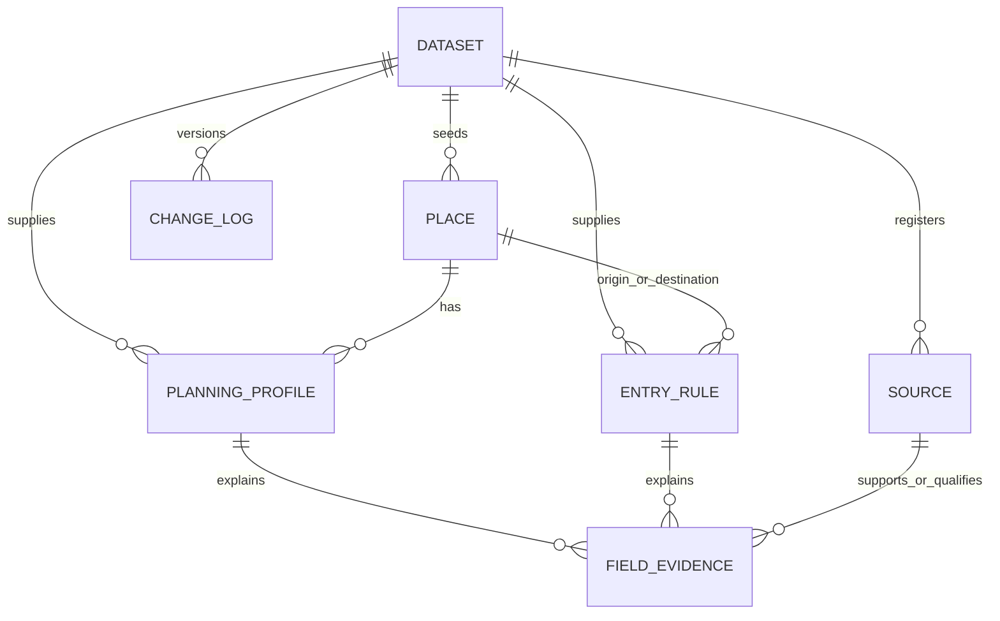

# Country Hub entity model v0.1

## Why the core entity is a jurisdiction

The public product may say “Country Hub,” but the canonical entity is a `jurisdiction`. This prevents sovereign states, territories, and special administrative regions from being treated as the same legal category. A filtered `country` view can expose sovereign states only.

## Three layers

1. **Domain records** — jurisdictions, traveller profiles, entry policies, planning profiles, cities, costs, safety, connectivity, healthcare, and immigration.
2. **Evidence and time** — sources, source checks, field claims, conflicts, revisions, and freshness.
3. **Publication** — translations, releases, artifacts, pages, and APIs.

## Claim kinds

Every material value must be classified as one of:

- `official_fact`: directly supported by an authoritative source.
- `official_source_synthesis`: a faithful compression of one or more authoritative sources.
- `editorial_judgment`: VisaAdvisor planning or explanatory judgment.
- `computed_value`: reproducible calculation with recorded inputs and method.
- `personal_experience`: consented first-person material, never universal evidence.

## Core v0.1 relationships

The seed export uses denormalized bilingual text only to preserve current published data. The target model atomizes fees, requirements, validity, stay, gateways, and translations.

## Target domain entities

| Entity | Grain | Required identifiers |
| --- | --- | --- |
| `jurisdiction` | One state or territory | internal ID, ISO2 when available, type, parent |
| `jurisdiction_name` | One name per jurisdiction/language/type | jurisdiction ID, BCP-47 language tag |
| `city` | One city | internal ID, jurisdiction ID, coordinates or durable external ID when verified |
| `airport` | One airport | internal ID, IATA/ICAO when verified, city/jurisdiction |
| `traveller_profile` | One passport/nationality/residence scenario | issuer, nationality, document type, residence, age class |
| `entry_policy` | One destination/purpose/pathway scenario | traveller profile, destination, purpose, arrival mode |
| `entry_policy_revision` | One effective version | policy ID, effective dates, method, review states |
| `entry_requirement` | One atomic requirement | policy revision, type, stage, condition, mandatory flag |
| `entry_fee` | One fee for one service/path | amount status, value, currency, payment stage, dates |
| `planning_profile_revision` | One dated planning recommendation | jurisdiction, audience, days, intensity, dates |
| `gateway` | One gateway in one planning revision | city/airport, rank, role |
| `seasonality_window` | One place/activity/time window | months, suitability, scope |
| `experience` | One named experience or attraction | jurisdiction/city, type, official name |
| `cost_observation` | One measured cost | place, category, amount range, currency, unit, date, methodology |
| `safety_assessment` | One authority's dated assessment | place, issuing authority, level, date |
| `safety_alert` | One active or historical alert | place, authority, start/end, severity |
| `emergency_contact` | One service/contact validity period | place, service, number, dates |
| `connectivity_offer` | One provider offer at a date | provider, place, product, price, allowance, date |
| `connectivity_observation` | One measured network observation | place, metric, value, unit, method, date |
| `healthcare_facility` | One facility | place, operator, location, official listing status |
| `immigration_pathway_revision` | One effective program version | pathway, eligibility, requirements, dates |
| `tax_residency_rule` | One dated rule and scenario | jurisdiction, condition, effective dates |

## Evidence entities

| Entity | Purpose |
| --- | --- |
| `source` | Stable identity of a page or document |
| `source_check` | One retrieval/review event with access state and content hash |
| `field_claim` | One atomic value in one record and language-neutral scope |
| `claim_evidence` | Many-to-many edge: supports, qualifies, contradicts, or contextualizes |
| `conflict_resolution` | Preserves the decision, reviewer, evidence, and unresolved questions |
| `legacy_identifier` | Maps existing IDs such as `AR-01` and `EGY-KEN-2026` |

## Mandatory separation rules

- `max_stay` and `authorisation_validity` are separate.
- `free`, numeric zero, `unknown`, `variable`, and `not_applicable` are separate fee states.
- Multi-value relationships are rows in bridge tables, not delimiter-separated production fields.
- Arabic and English translations reuse the same fact/claim ID.
- Effective dates, verification dates, and publication dates are separate.
- Source authority and evidence scope are separate: a government fee page does not automatically prove passport eligibility.

## ID conventions

- Place: `PLC-` + uppercase ISO2, for example `PLC-AR`.
- Planning profile: `PLAN-` + ISO2 + version token.
- Entry rule seed: preserved legacy ID, for example `EGY-KEN-2026`.
- Source: namespace + legacy ID, for example `SRC-SA-AR-01` or `SRC-EG-SRC-01`.
- Evidence edge: deterministic prefix + record + field + sequence.
- Release: semantic version, for example `CH-0.1.0`.

IDs are never reused after publication.
